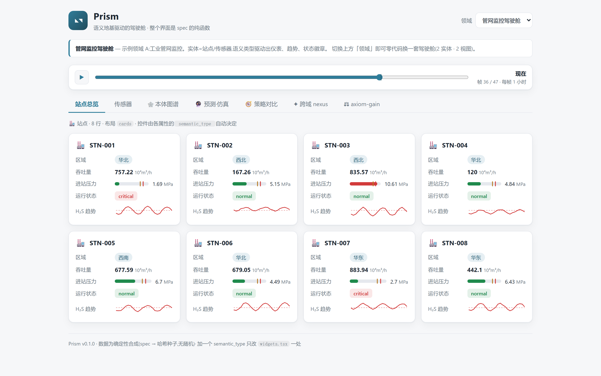
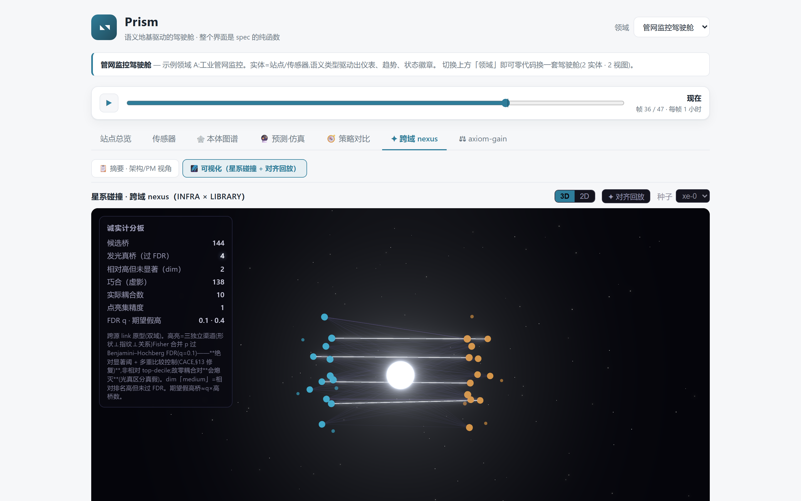
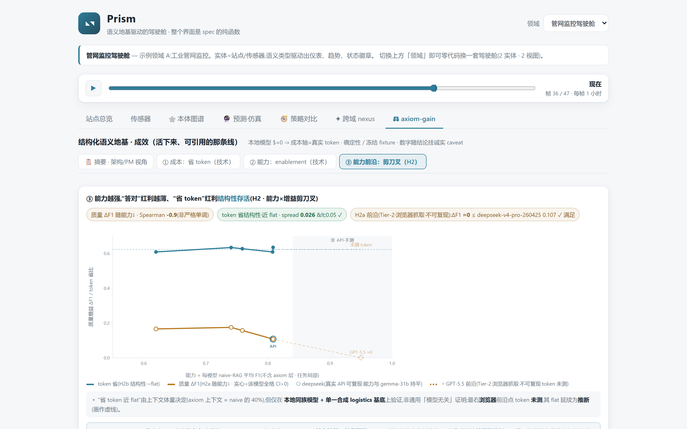

# Prism — 语义地基驱动的驾驶舱

Prism turns a semantic spec into a complete domain cockpit. Tabs, panels, widgets, data synthesis, replay, graph views, and decision-support labs are generated from the spec; the backend and frontend stay domain-agnostic.

The repository has two goals:

1. Show that a domain cockpit can be treated as `UI = f(spec)`.
2. Explore whether a deterministic semantic layer in front of an LLM can reduce context size and enable cross-source tasks under controlled synthetic conditions.

All reported research results are scoped to this repository's deterministic synthetic substrate unless noted otherwise.

## What It Looks Like

A spec describes entities, attributes, semantic types, views, relations, and temporal behavior. The same runtime renders different domains without rewriting the app.



Prism also includes a cross-domain nexus lab. Two datasets are drawn as two record galaxies; only links passing the configured evidence and significance checks are highlighted.



The axiom-gain lab compares raw multi-source context with a pre-linked semantic substrate before the prompt is sent to a model.



Related repository: [prism-datagen](https://github.com/ForTe13X/prism-datagen), the standalone deterministic data-package generator extracted from this project.

## Core Idea

Traditional dashboards usually hard-code domain views in application code. Prism moves that structure into a declarative semantic spec:

```text
Semantic spec                 Domain-agnostic runtime              Result
────────────────────          ─────────────────────────            ─────────────────
entities + attributes   ->    backend reads semantic_type    ->    /spec and /data
views + relations             frontend renders views               generated cockpit
temporal behavior             widget resolver selects controls      UI = f(spec)
```

The repository includes two intentionally different domains:

- `backend/specs/infra_monitoring.json`: industrial infrastructure monitoring.
- `backend/specs/library_catalog.json`: library collection and branch activity.

Switch the domain in the UI and the same engine renders a different cockpit from a different spec.

## Research Labs

The research tabs are designed as controlled experiments, not production claims. Numbers are loaded from API fixtures and documented protocols so the UI and backend stay in sync.

| Area | Current finding | Where to inspect |
|---|---|---|
| Axiom layer vs raw RAG | In the registered matrix, the semantic substrate reduces input tokens by about 61% while keeping quality non-decreasing on the measured proxy tasks | `GET /api/axiomgain/logistics_demo/protocol`, [docs/RESEARCH_axiom_gain.md](docs/RESEARCH_axiom_gain.md) |
| Cross-source coreference | When two systems have no shared key, raw retrieval scores near zero; deterministic resolver output makes the task solvable in the synthetic setup | `GET /api/split/ablation`, [docs/DESIGN_data_package.md](docs/DESIGN_data_package.md) |
| Model-capability trend | Quality gain shrinks as model capability rises, while token reduction remains mostly structural in the tested setup | [docs/PREREG_axiom_gain_frontier.md](docs/PREREG_axiom_gain_frontier.md), [docs/RESEARCH_axiom_gain.md](docs/RESEARCH_axiom_gain.md) |
| Negative result | A learned alias dictionary adds no held-out F1 in this setup, so its build cost does not amortize | [docs/RESEARCH_axiom_gain.md](docs/RESEARCH_axiom_gain.md) |
| Nexus calibration | Calibrating synthetic edges toward real-data variability makes some nexus results indeterminate instead of significant | [docs/METRIC_nexus_reality.md](docs/METRIC_nexus_reality.md) |
| Visualization fix | Galaxy links now use absolute significance thresholds with FDR correction instead of relative top-decile highlighting | `GET /api/nexus_xdom/fdr_check`, [docs/METRIC_nexus_reality.md](docs/METRIC_nexus_reality.md) |

Open boundary: the external validity of synthetic cross-domain coupling is not closed. Any claim about real-world discovery needs real calibration data and a separate validation protocol. See [docs/OBSERVER_NOTES.md](docs/OBSERVER_NOTES.md).

## Architecture

| Layer | Stack | Responsibility |
|---|---|---|
| Backend | FastAPI, Python | Load specs, synthesize deterministic data, expose spec/data/timeline/graph/simulation/policy/compile/data-package/axiom APIs |
| Frontend | Vite, React, TypeScript | Fetch specs, generate tabs and panels from `views`, and resolve widgets from `semantic_type` |

The backend does not know domain words such as "pipeline" or "book". `data_synth.py` works from semantic types and spec fields. Replacing synthetic rows with a real source is intended to require a data adapter behind the same API rather than a frontend rewrite.

## Run Locally

```bash
# Backend, example port 8200.
cd prism
python -m venv .venv
.\.venv\Scripts\activate
pip install -r backend/requirements.txt
python -m uvicorn backend.app.main:app --port 8200

# Frontend, in another terminal.
cd prism/frontend
npm install
npm run dev
```

The frontend defaults to `http://127.0.0.1:8200`. Set `VITE_API_BASE` to use another backend URL.

## Spec And Extension Points

Semantic types in v0:

```text
identifier · category · status · metric · gauge · timeseries · text
```

Adding a new semantic type usually requires two changes:

1. Add a widget branch in `frontend/src/widgets.tsx`.
2. Add deterministic synthesis behavior in `backend/app/data_synth.py`.

Spec details are in [docs/SPEC_FORMAT.md](docs/SPEC_FORMAT.md).

## Implemented Modules

| Module | Summary |
|---|---|
| Timeline replay | `temporal` specs generate deterministic frame-by-frame data; the frontend slider replays all panels from the selected frame |
| Ontology graph | Entity instances and relations render as a stable graph; node details reuse the same widget resolver |
| Prediction simulation | `POST /api/sim/{id}` runs deterministic what-if trajectories with uncertainty bands and threshold checks |
| Policy comparison | `POST /api/policy/{id}` evaluates typed sequential policies with shared disturbance sequences and sensitivity checks |
| Natural-language policy compile | `POST /api/compile/{id}` can translate a user phrase into typed IR through a local OpenAI-compatible endpoint, then waits for human review before simulation |
| Cross-source data package | `GET /api/datapackage...` builds deterministic multi-source packages with embedded ground truth and reference solvers |
| Axiom-gain benchmark | `GET /api/axiomgain/{id}` reports fixture-backed comparisons between raw context and pre-linked semantic context |

Design notes are linked from [docs/ROADMAP.md](docs/ROADMAP.md), [docs/DESIGN_what_if_sequential.md](docs/DESIGN_what_if_sequential.md), [docs/DESIGN_data_package.md](docs/DESIGN_data_package.md), and [docs/RESEARCH_axiom_gain.md](docs/RESEARCH_axiom_gain.md).

## Reproducibility And Scope

- Determinism comes from sha256-derived seeds, no wall-clock time, and frozen fixtures for LLM benchmark runs.
- Synthetic values are labeled as synthetic; simulations are decision-support examples, not measured plant behavior.
- Local-model cost uses token counts, not dollar estimates, unless an external API trace is explicitly cited.
- Clean-room scope: this repository contains its own code and does not import private or third-party product codebases.
- The research line studies controlled synthetic cross-source tasks. It does not claim real-world nexus discovery.

## Roadmap

- [ ] More semantic types: relation, geo, money, duration, enum distribution.
- [ ] Real data adapters for SQL, CSV, and REST behind the current API.
- [ ] JSON Schema validation and a visual spec editor.
- [ ] Relation-driven drilldown between entities.
- [ ] View-level KPI headers, filters, and sorting.
- [ ] Locale switching through spec labels.
- [ ] Additional density and theme controls.
- [x] Backend determinism and boundary tests, plus frontend widget snapshot tests.
- [ ] End-to-end browser tests.
- [ ] Authentication and multi-tenant spec sets.
