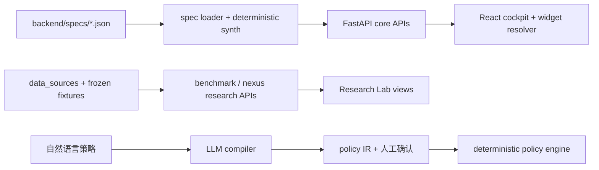

# Prism demo 项目评审结论

> 评审日期：2026-07-11
>
> 基线提交：`720fa60`（`master` / `origin/master`）
>
> 交付方式：独立 worktree + `codex/demo-review-20260711` 分支；未修改被评审代码、根 README 或当前 `master` 工作区。

## 结论先行

Prism 是一个**想法清楚、桌面端展示完成度高、研究诚实意识突出的研究型 demo**。最有价值、也最容易让外部读者理解的主线是：

> `UI = f(spec)`：同一套领域无关 runtime，根据 semantic spec 生成不同领域驾驶舱。

这条核心线已经具有说服力：两个差异明显的领域、统一 semantic type/widget 映射、时间回放、图谱、仿真与较好的首屏演示共同有力支持了概念。项目也难得地保留负结果、合成数据边界和校准后塌缩等不利证据。

当前不应把它直接视为生产系统或可独立复现的开源研究交付物。fresh-clone 路径会在 Nexus 页面触发白屏；仿真比较存在会改变结论的扰动公平性问题；H2 初始 fallback 不含已知反例，补充数据加载失败又会被静默吞掉；依赖、CI、许可证和实验 provenance 也尚未收口。

| 维度 | 判断 | 说明 |
|---|---|---|
| 核心 idea | 强 | `spec → runtime → cockpit` 命题简单、可演示、可扩展 |
| 桌面 demo | 强，但有一条白屏路径 | 主驾驶舱清楚；Nexus 在 README 最小安装环境中会崩溃 |
| 架构 | 中上 | core 边界清楚；research/decision modules 逐渐穿透与重复 |
| 测试意识 | 强 | 确定性、负控制、honesty invariant 和纯函数测试突出 |
| fresh-clone 复现 | 弱 | 测试/研究依赖与版本未声明，无仓库 CI |
| 研究结论表达 | 需收紧 | caveat 很多，但正式措辞与失败时的 fallback 仍偏乐观 |
| 移动端与无障碍 | 弱 | 已实测窄屏溢出；关键交互缺少完整语义 |
| 生产就绪度 | 低，且项目本身也未声称已就绪 | 无鉴权/rate limit，CORS 宽松，重计算发生在在线请求内 |

## 项目结构理解

建议在产品叙事和导航上正式分成三层：

1. **Core Runtime**：spec-driven cockpit，是最强主产品叙事。
2. **Decision Lab**：simulation / policy / NL-to-IR，是实验性决策支持。
3. **Research Labs**：axiom-gain / nexus，是带数据卡和方法边界的研究面板。

现在 Research Labs 是 spec-independent，却与领域 tab 混在同一层导航，容易让用户误以为它们也是当前 spec 自动生成的能力。

## Pros

### 1. 核心命题清楚且有真实代码边界支撑

- README 用两个领域说明同一 runtime 根据 spec 生成界面，而不是只写概念（[`README.md:5-10`](../../README.md#L5-L10)、[`README.md:46-51`](../../README.md#L46-L51)）。
- `Cockpit` 根据 `spec.views` 生成视图，widget 映射集中在一个 resolver，新增领域的主要改动面确实较小（[`frontend/src/Cockpit.tsx:232-275`](../../frontend/src/Cockpit.tsx#L232-L275)、[`frontend/src/widgets.tsx:60-95`](../../frontend/src/widgets.tsx#L60-L95)）。
- spec id 使用白名单正则并核对文档 id，避免路径穿越（[`backend/app/specs_loader.py:13-14`](../../backend/app/specs_loader.py#L13-L14)、[`backend/app/specs_loader.py:40-51`](../../backend/app/specs_loader.py#L40-L51)）。

### 2. 确定性与“诚实不变量”是明显差异化优势

- 仿真、数据包和研究基准普遍使用确定性 hash seed，不依赖墙钟。
- benchmark 的 Web API 默认只读 frozen fixture，不会在浏览页面时静默触发 live LLM（[`backend/app/benchmark_routes.py:1-2`](../../backend/app/benchmark_routes.py#L1-L2)、[`backend/app/benchmark_routes.py:27-33`](../../backend/app/benchmark_routes.py#L27-L33)）。
- 测试不只覆盖 happy path，还锁定负控制、caveat 文案、显著性门和历史 bug。

### 3. 研究文化比普通 demo 更成熟

- README 明确把研究结果限制在合成 substrate，并披露外部效度尚未闭合（[`README.md:12`](../../README.md#L12)、[`README.md:55-66`](../../README.md#L55-L66)、[`README.md:124-130`](../../README.md#L124-L130)）。
- 学习式 alias dictionary 没有收益、真实噪声校准后 nexus 塌缩等负结果被保留，而不是删除不漂亮的实验。
- 项目有预注册、ground truth、冻结 fixture 与浏览器抓取 provenance 的意识。

### 4. 前端对复杂可视化的工程处理较成熟

- 3D galaxy 懒加载，WebGL 不可用时回退到 2D，且有局部 error boundary（[`frontend/src/NexusView.tsx:6-36`](../../frontend/src/NexusView.tsx#L6-L36)）。
- 多数图表使用 `viewBox`；表格有滚动容器；Three.js 大包没有进入主 bundle。
- TypeScript 开启 strict 及未使用变量/参数检查（[`frontend/tsconfig.json:3-18`](../../frontend/tsconfig.json#L3-L18)）。

### 5. 当前基础测试是健康的

- 后端：`217 passed`；3 个 sklearn-dependent modules 在 collection 时 skipped；约 `124.26s`。
- 前端：`7` 个测试文件、`54 passed`。
- TypeScript + Vite production build 成功。
- 主 bundle：约 `206.72 kB`，gzip `69.61 kB`。
- 3D lazy chunk：约 `891.83 kB`，gzip `239.74 kB`。

## Cons / 风险与建议

优先级定义：P0 是“再次公开演示或发布研究结论前应处理”；P1 是下一轮工程迭代；P2 是后续收口与扩展。

## P0

### P0-1：README 最小安装环境下，进入默认 Nexus 摘要会整页白屏

**已验证链路：**

1. [`backend/requirements.txt`](../../backend/requirements.txt) 只声明 FastAPI 与 Uvicorn；README 也只要求安装该文件（[`README.md:77-93`](../../README.md#L77-L93)）。
2. `/api/nexus_xdom/real_coupling` 实际需要 `scikit-learn`。缺依赖时，后端捕获异常并返回普通字典，而不是非 2xx 状态（[`backend/app/nexus_real_pair.py:125-132`](../../backend/app/nexus_real_pair.py#L125-L132)、[`backend/app/nexus_routes.py:110-117`](../../backend/app/nexus_routes.py#L110-L117)）。
3. 前端的 `getJSON<T>` 只看 HTTP 状态，然后直接做 TypeScript 强转（[`frontend/src/api.ts:25-29`](../../frontend/src/api.ts#L25-L29)）。HTTP 200 的 `{"error": ...}` 因此被当成 `NexusRealCoupling`。
4. `NexusSummary` 用 `Promise.all` 接收该对象，并立即读取不存在的嵌套字段（[`frontend/src/NexusView.tsx:261-270`](../../frontend/src/NexusView.tsx#L261-L270)、[`frontend/src/NexusView.tsx:319-330`](../../frontend/src/NexusView.tsx#L319-L330)）。
5. 应用没有全局 error boundary，最终整个 React root 白屏。浏览器 console 可复现：`Cannot read properties of undefined (reading 'semantic_zscore_auc')`。

**建议：**

- 决定 sklearn 能力是否属于默认 demo：若是，加入锁定依赖；若不是，不要默认加载相关卡片。
- 后端缺可选依赖时返回 `503` 和统一 error envelope，不能返回 HTTP 200 的错误对象。
- 前端对关键 response 做运行时校验，并让三张研究卡独立加载/独立失败，不要 `Promise.all` 一损俱损。
- 增加应用级 error boundary 与 retry UI。
- 增加 fresh-venv 浏览器 smoke test，专门覆盖 Nexus tab。

### P0-2：simulation 的比较不是公平反事实，label 会改变扰动序列

`simulation._roll()` 把用户可改的 `label` 放进 shock seed（[`backend/app/simulation.py:61-77`](../../backend/app/simulation.py#L61-L77)），随后直接对不同 scenario 的轨迹做 verdict 排名（[`backend/app/simulation.py:101-119`](../../backend/app/simulation.py#L101-L119)）。

实测两个 `delta=0` 的 no-op 情景，仅 label 不同，终值分别为 `5.702` 与 `6.040`，而 baseline 为 `5.529`。它们没有干预差异，差异完全来自不同噪声。另一组测试中 no-op 甚至被判为最佳情景。

policy 引擎已经正确使用 common random numbers，并有回归测试（[`backend/app/policy.py:89-104`](../../backend/app/policy.py#L89-L104)、[`backend/tests/test_policy.py:53-59`](../../backend/tests/test_policy.py#L53-L59)）。simulation 与 policy 重复实现 dynamics/hash 内核，正是行为漂移的来源之一。

**建议：**从 simulation shock seed 删除 label，抽共享 deterministic dynamics kernel，并增加“不干预等于 baseline、改名不改数值、相同干预共享扰动”的不变量测试。

### P0-3：H2 的正式措辞仍过强，完整数据加载失败会静默退回乐观 fallback

**已验证事实：**

- README 的 headline 是“模型越强，质量增益越小”（[`README.md:61`](../../README.md#L61)）。
- 项目正文已经承认第 4 个本地模型打破严格单调，完整方向性结果约为 `Spearman -0.80`（[`docs/RESEARCH_axiom_gain.md:124-137`](../../docs/RESEARCH_axiom_gain.md#L124-L137)）。
- H2 tab 会先用 3-model fallback 渲染，再异步请求 `include_h2_extra=true` 的完整 5-model 版本（[`frontend/src/AxiomGainView.tsx:101-110`](../../frontend/src/AxiomGainView.tsx#L101-L110)）。实测初始 headline 为 `Spearman -1`；extra 成功时应升级为包含已知反例与 DeepSeek 的 `Spearman -0.90`。
- extra 请求失败会被空 `catch` 静默吞掉，没有 loading/error 标识，届时页面会永久停留在更乐观的 fallback。这里的问题不是“从不加载反例”，而是 fallback 被当成完整结论展示、失败又不可观察。
- GPT-5.5 只有 `4 naive + 1 axiom`、单脏度、浏览器抓取且不可绑定模型版本，却仍在研究文档中写成 `CONFIRMED`（[`docs/PREREG_axiom_gain_frontier.md:104-134`](../../docs/PREREG_axiom_gain_frontier.md#L104-L134)）。项目自己的后续复检也已判断该动词过强（[`docs/OBSERVER_NOTES.md:308-321`](../../docs/OBSERVER_NOTES.md#L308-L321)）。

此外，`capability = naive F1`、`gain = axiom F1 - naive F1`；当 axiom F1 接近饱和时，负相关的一部分会由代数关系诱导，并非独立经验关系。项目自己的 observer 复检已经指出这一点。

**建议：**

- H2 tab 在完整 extra 到达前显示明确的“加载完整 H2 集合”状态；失败时展示错误，不能静默保留 3-model headline。
- headline 使用包含已知反例的完整集合，并同时展示 strict monotonicity 已失败；DeepSeek 保留其 prompt-JSON 构造差异标记。
- 把结论拆成：严格单调已被反例推翻；负相关仅是任务局部、方向性证据；GPT-5.5 只是与趋势一致的提示性单点。
- 将当前 bootstrap CI 明确写为“条件于一次冻结 completion、以 synthetic seed 为采样单位”，不要让读者理解成覆盖模型运行方差/provider 漂移。
- 将 `CONFIRMED` 改为 `consistent with` / “提示性支持”。

### P0-4：公开仓库没有许可证

仓库和 GitHub metadata 均未发现 `LICENSE`；同时也没有 `CONTRIBUTING.md`、`SECURITY.md`、`CITATION.cff`。如果目标只是个人展示，可以明确写“source available”；如果希望他人复制、修改或再分发，许可证是发布阻断项。

**建议：**先确认作者意图，再选择许可证，并核对真实数据、媒体和模型输出 artifact 的许可/notice。不要在未确认意图时由工具代替作者选择。

## P1

### P1-1：frame 0 的 pulse/event 被静默忽略

- API 默认允许 `Scenario.at = 0` 和 `PolicyEvent.at_frame = 0`（[`backend/app/sim_routes.py:17-29`](../../backend/app/sim_routes.py#L17-L29)、[`backend/app/policy_routes.py:31-53`](../../backend/app/policy_routes.py#L31-L53)）。
- 两个引擎都从 frame 1 开始循环，只在 `f == at` 时执行（[`backend/app/simulation.py:69-75`](../../backend/app/simulation.py#L69-L75)、[`backend/app/policy.py:98-111`](../../backend/app/policy.py#L98-L111)）。

实测 `pulse at=0` 和 `event at_frame=0` 改变幅度后轨迹完全不变。

**建议：**明确 frame 0 语义。若表示“现在”，在记录初值前应用；若只允许未来事件，则用 `ge=1` 拒绝 0，不能静默 no-op。

### P1-2：“typed IR” 在 API 边界并没有真正 typed

`op`、`action` 目前只是普通 `str`，浮点数没有 finite/range 约束，rules/events/scenarios 没有长度上限（[`backend/app/policy_routes.py:15-53`](../../backend/app/policy_routes.py#L15-L53)、[`backend/app/sim_routes.py:17-29`](../../backend/app/sim_routes.py#L17-L29)）。

实测 `op=BANANA`、`action=TELEPORT` 等非法规则返回 HTTP 200，并被静默当成 no-op；`_MAX_RULES=8` 虽已声明，却没有应用（[`backend/app/policy.py:26-30`](../../backend/app/policy.py#L26-L30)、[`backend/app/policy.py:117-121`](../../backend/app/policy.py#L117-L121)）。

**建议：**使用 `Literal`/枚举、finite validator、`extra="forbid"` 和列表 `max_length`；非法 IR 返回 422，不要把错误输入伪装成有效方案。

### P1-3：重计算接口公开、在线请求内重算且部分无边界

- simulation scenarios 无上限；policy rules/events 无上限。
- `/calibrate` 与 `/calibrate_sweep` 的 `conv_seeds` 未限制（[`backend/app/nexus_routes.py:135-149`](../../backend/app/nexus_routes.py#L135-L149)）。
- 多个无参数确定性结果每次请求都在同步 `def` handler 内重新计算，占用 FastAPI 线程池。当前机器实测：`gate ~1.4s`、`channels ~16.9s`、`align_eval ~1.8s`、`fdr_check ~6.3s`。

**建议：**统一硬上限；对确定性无参数结果做预计算或缓存；长任务改作 job API；部署时加并发限制、超时和 rate limit。

### P1-4：前端异步状态存在竞态、旧结果冒充新结果和请求风暴

- App 的领域切换请求没有 cancelled/request-id guard；成功后也不清理旧 error（[`frontend/src/App.tsx:13-27`](../../frontend/src/App.tsx#L13-L27)）。快速切换时旧响应可能覆盖新选择。
- Sim/Policy 在 horizon、名称、每条规则的每次输入变化后立即 POST，只忽略旧响应、不 abort 请求（[`frontend/src/SimView.tsx:57-76`](../../frontend/src/SimView.tsx#L57-L76)、[`frontend/src/PolicyView.tsx:97-123`](../../frontend/src/PolicyView.tsx#L97-L123)）。
- 两页的 `fresh` 只比较 spec/entity/attribute，没有比较 horizon、row 或 scenario/rule key；控制区已经是新参数时，旧图仍会被标为 fresh（[`frontend/src/SimView.tsx:110-113`](../../frontend/src/SimView.tsx#L110-L113)、[`frontend/src/PolicyView.tsx:207-208`](../../frontend/src/PolicyView.tsx#L207-L208)）。
- 时间回放刻意保留旧 rows 避免闪烁，但 frame label 已先更新，用户会在“新帧”标题下短暂看到上一帧数据（[`frontend/src/Cockpit.tsx:110-114`](../../frontend/src/Cockpit.tsx#L110-L114)、[`frontend/src/Cockpit.tsx:125-146`](../../frontend/src/Cockpit.tsx#L125-L146)）。

**建议：**API 接收 `AbortSignal`；每个结果绑定完整 canonical request key；显式“运行”或 200–300ms debounce；保留旧图时明确显示“旧结果 / 更新中”。

### P1-5：窄屏与无障碍不是完整支持状态

**运行态实测：**320px viewport 下，策略页 `scrollWidth=354`、内容区 `clientWidth=305`，确定性横向溢出约 49px。固定 `330px` 最小列宽是直接原因之一（[`frontend/src/styles.css:253`](../../frontend/src/styles.css#L253)）。header、Nexus controls 和 600px canvas 也缺少系统性 breakpoint。

无障碍方面：

- 主 tabs 只有视觉 active class，没有完整 tablist/tab/aria-selected/panel 键盘模式（[`frontend/src/Cockpit.tsx:232-263`](../../frontend/src/Cockpit.tsx#L232-L263)）。
- Policy 结果使用带 `onClick` 的 table row 选轨迹，键盘不可操作。
- Ontology SVG 同时是 `role="img"`，内部再放 button 语义，存在交互后代被辅助技术折叠的兼容风险；sparkline 没有 accessible name 或数值摘要。
- loading/error 多数没有 `role=status`、`role=alert` 或 live region。

**建议：**先加 720/480 两档响应式规则，grid 使用 `minmax(min(100%, 330px), 1fr)`；把可点击行改成单元格内 button；实现完整 tabs/toggle/live-region pattern；给图表提供文本摘要和 HTML 替代通道。

### P1-6：测试很多，但缺少“一键复现”和真正的集成层

README 安装的 backend 环境没有 pytest/httpx/sklearn；本次必须额外创建 venv 并安装测试依赖才能运行。版本仅使用无上界 `>=`，当前安装已经出现 Starlette TestClient deprecation warning。

仓库没有自有 `.github/workflows`、`pyproject.toml`/pytest 配置或 dev/research requirements。前端 54 个测试主要是纯函数与 widget snapshot，没有 App/Cockpit/SimView/PolicyView/NexusView 的用户交互测试（[`frontend/package.json:6-28`](../../frontend/package.json#L6-L28)、[`README.md:141-143`](../../README.md#L141-L143)）。因此白屏、竞态、键盘和窄屏问题不在现有测试覆盖范围内。

**建议：**

- Python 拆分 runtime/test/research extras，并锁定已验证范围。
- CI 覆盖 minimal install 与 research extra 两套环境。
- 前端先补 RTL + MSW 的乱序/失败测试，再补 3–5 条 Playwright smoke：领域切换、回放、仿真编辑、Nexus、移动 viewport。
- 增加 ESLint（React Hooks、jsx-a11y、TypeScript recommended）与 coverage threshold。

### P1-7：本地 demo 的安全边界不能直接继承到部署

- CORS 允许任意 origin（[`backend/app/main.py:27-34`](../../backend/app/main.py#L27-L34)）。
- compile 路由无鉴权，可触发最长 90s 的远端 OpenAI-compatible 请求；如果配置付费 `PRISM_LLM_BASE/KEY`，访问者可以消耗真实预算。
- 公开重计算 GET 同样没有 rate limit。

当前 README 默认 loopback，因此不是现状攻击漏洞；一旦绑定外网，应立即把它提升为发布阻断项。

### P1-8：文档像高质量实验日志，但 current / archive / superseded 混在一起

`ROADMAP`、`DEMANDS` 和多个 DESIGN 文件开头仍写“未建成/下一步”，后文或 README 却已标为完成；一些文档还有本机绝对路径。英文 README 深链的大部分详细材料仍只有中文。

**建议：**增加 `docs/INDEX.md` 和 capability/status matrix；每份文档标注 `current / historical / superseded`、last verified commit；把 observer snapshots 保留为实验日志，但不要让它们承担当前 reference 文档职责。

### P1-9：scenario 使用可重复 label 作为身份，会让结果归属歧义

仿真允许空名、重复名和保留名 `baseline`，但 verdict 的 `breaches` 使用 label-keyed 字典；重复值会覆盖。policy 已经有 label dedupe，simulation 没有对应保护（[`backend/app/simulation.py:101-119`](../../backend/app/simulation.py#L101-L119)、[`backend/app/policy.py:145-157`](../../backend/app/policy.py#L145-L157)）。

**建议：**API 使用稳定 id 做身份，label 只作展示；短期至少前后端共同拒绝或去重空名称、重复名称和 `baseline`。

### P1-10：fixture 可复算，但 provenance 与并发写入仍不足

cache key 已经哈希 `model/system/user/schema`（[`backend/app/llm_client.py:239-241`](../../backend/app/llm_client.py#L239-L241)），但代码明确没有把 `max_tokens` 纳入 key（[`backend/app/llm_client.py:261-264`](../../backend/app/llm_client.py#L261-L264)），记录本身也只保存 content/usage/model。provider/base、model revision、fallback mode、时间、request id、tokenizer 与 cost 均缺失；read-modify-write 也不是原子操作。

**建议：**增加 machine-readable experiment manifest，并使用 atomic replace/file lock；对正式研究结论记录原始请求/响应摘要和 fixture hash。

## P2

- **统一响应契约**：36 个 API operation 大多只返回 raw `dict`，错误状态混用 HTTPException、`ok=false` 和 HTTP 200 error body。补 response model 与统一 error envelope。
- **完整 spec validation**：loader 目前只检查 JSON 与 id；字段遗漏会在下游变成 500。建议启动时用 Pydantic/JSON Schema 验证并报告字段路径。
- **稳定内部数据类型**：大量模块跨文件导入 `_unit`、`_DEFAULT_ROLES`、`_bh_reject` 等私有符号；为 generator/eval/nexus 建少量公开 dataclass/TypedDict。
- **拆大组件**：Policy/Nexus/AxiomGain 同时负责状态、请求、编辑器、图表与长文案。抽 query hooks、controls、charts 和 result cards。
- **修小型显示 bug**：H2 chip 在 JSX 字符串里写了 `"&lt;0.05 ✓"`，浏览器实际显示字面量 `&lt;0.05`（[`frontend/src/AxiomGainView.tsx:143`](../../frontend/src/AxiomGainView.tsx#L143)）。
- **前端依赖收口**：`npm audit` 当前报告 5 项（3 moderate、1 high、1 critical，主要在 Vite/Vitest 开发工具链）；`three@0.160.1` 也不满足嵌套 `postprocessing@6.39.1` 的 peer range。升级前先建兼容矩阵和视觉回归，不建议直接 `audit fix --force`。
- **性能**：3D chunk 已正确懒加载，但仍接近 892 kB；可在 reduced-motion 下使用 demand render、自适应 DPR/粒子数，并评估拆分 Three/postprocessing。

## 推荐落地顺序

### 第 0 阶段：让当前 demo 的承诺成立

1. 修 Nexus fresh-clone 白屏：依赖、503、运行时校验、局部降级、全局 error boundary。
2. 修 simulation common-random-numbers 与 frame-0 语义，补不变量测试。
3. H2 完整集合加载前后使用明确状态、失败可观察，并全面降级 `CONFIRMED` 等过强措辞。
4. 明确许可证意图。

### 第 1 阶段：做成可持续迭代的 demo

1. runtime/test/research 依赖分层 + lock + CI。
2. 收紧 typed IR、列表/seed 上限，缓存确定性重计算结果。
3. 修请求竞态、旧结果标识、移动端和关键无障碍交互。
4. 将 Core Runtime、Decision Lab、Research Labs 分层呈现。

### 第 2 阶段：按目标选择路线，不要同时扩张

| 目标 | 优先投入 | 暂缓 |
|---|---|---|
| 强 demo / portfolio | 第三个领域的 5 分钟教程、真实 CSV/SQL adapter、E2E | 再增加研究支线 |
| 开源研究 artifact | experiment manifest、重复 LLM runs、data/model card、citation | 产品化包装 |
| 生产原型 | auth、adapter、job queue、observability、SLO | 对合成结果继续精雕叙事 |

如果只做一件产品层的事：**把 `UI = f(spec)` 做成一个外部人 10 分钟内能亲手新增第三领域的教程**。这比继续增加一个新实验 tab 更能证明 Prism 的可迁移价值。

## 验证记录

| 检查 | 结果 |
|---|---|
| 原始 `master` 工作区 | clean，未修改 |
| Python | 3.14.3；隔离 venv |
| Backend tests | 217 passed / 3 sklearn-dependent modules skipped during collection / 1 warning / 124.26s |
| Frontend tests | 54 passed / 7 files |
| Frontend build | success；有 >500 kB chunk warning |
| npm dependency tree | Three.js peer conflict |
| npm audit | 5 findings（dev tooling 为主） |
| Browser desktop smoke | 主 cockpit、simulation、policy、axiom-gain 可渲染 |
| Browser fresh-install Nexus | 可复现整页白屏 |
| Browser 320px policy | 可复现约 49px 横向溢出 |

## 评审边界

- 没有启动或付费调用真实 LLM；只检查了 frozen fixtures 和 LLM client 边界。
- 没有安装 sklearn，目的是验证 README 所述最小安装路径；因此 3 个 research test modules 在 collection 时 skipped，并暴露 Nexus 白屏。
- 没有做生产负载测试、渗透测试或真实数据合规审计。
- `npm audit` 是 2026-07-11 的当前 advisory 快照，会随上游数据库变化。
- 本报告只提出建议，没有修改业务实现；所有修复应拆成独立 PR。
